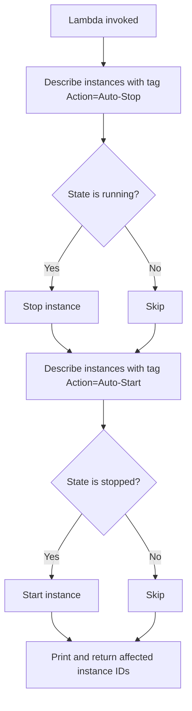

AWS setup checklist

* EC2 — Two instances:

  - Instance 1: Action = Auto-Stop (should be running before test)
  - Instance 2: Action = Auto-Start (should be stopped before test)

* IAM role — Lambda execution role with AmazonEC2FullAccess (or scoped ec2:DescribeInstances, ec2:StopInstances, ec2:StartInstances).

* Lambda — Python 3.x runtime, paste the code above, assign the IAM role.

* Test — Manually invoke the function, then verify in EC2:
  - Auto-Stop instance → stopped
  - Auto-Start instance → running

Check CloudWatch Logs for lines like Stopping instance: i-xxx and Starting instance: i-yyy.

