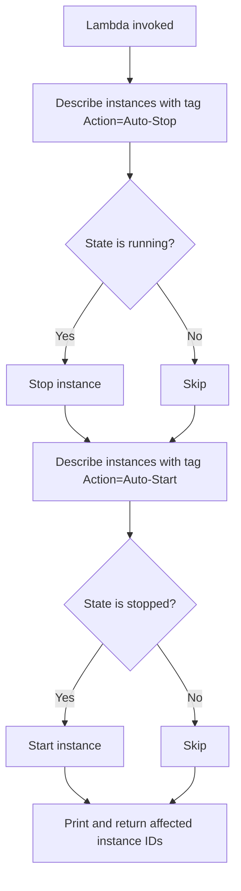

AWS setup checklist

* EC2 — Two instances:

  - Instance 1: Action = Auto-Stop (should be running before test)
  - Instance 2: Action = Auto-Start (should be stopped before test)

* IAM role — Lambda execution role with AmazonEC2FullAccess (or scoped ec2:DescribeInstances, ec2:StopInstances, ec2:StartInstances).

* Lambda — Python 3.x runtime, paste the code above, assign the IAM role.

* Test — Manually invoke the function, then verify in EC2:
  - Auto-Stop instance → stopped
  - Auto-Start instance → running

Check CloudWatch Logs for lines like Stopping instance: i-xxx and Starting instance: i-yyy.

## Screenshots

| Step | File |
|------|------|
| EC2 instances with tags (before test) | [ec2-instances-before.png](screenshots/ec2-instances-before.png) |
| Lambda function code in console | [lambda-function.png](screenshots/lambda-function.png) |
| Lambda test invocation result | [lambda-test-run.png](screenshots/lambda-test-run.png) |
| CloudWatch logs | [cloudwatch-logs.png](screenshots/cloudwatch-logs.png) |
| EC2 instances after run | [ec2-instances-after.png](screenshots/ec2-instances-after.png) |

## CLI test

```bash
aws lambda invoke \
  --function-name gk_ec2_start_stop \
  --payload '{}' \
  --cli-binary-format raw-in-base64-out \
  response.json && cat response.json
```

