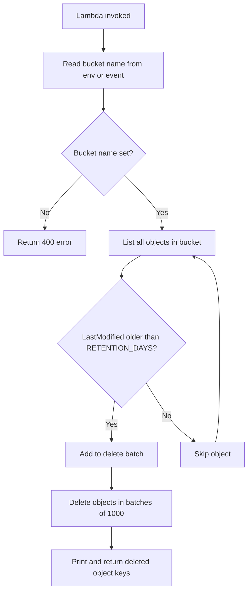

AWS setup checklist

* S3 — Create a dedicated test bucket (do not use production buckets):

  - Bucket: `gk-s3-cleanup-test-232818307988`
  - Upload test files: `new-file.txt`, `old-file.txt`, `keep-file.txt`

* IAM role — Lambda execution role with `AmazonS3FullAccess` (or scoped `s3:ListBucket`, `s3:DeleteObject` on the test bucket).

* Lambda — Python 3.x runtime (**not Node.js**), handler `lambda_function.lambda_handler`.

* Environment variables:

  | Key | Value | Purpose |
  |-----|-------|---------|
  | `BUCKET_NAME` | `gk-s3-cleanup-test-232818307988` | Target bucket |
  | `RETENTION_DAYS` | `30` | Delete objects older than 30 days (default) |

* Test — Two scenarios:

  1. **RETENTION_DAYS=30** — newly uploaded files are kept; Lambda returns `deleted_objects: []`
  2. **RETENTION_DAYS=0** — all objects are older than cutoff; Lambda deletes every file in the bucket

Check CloudWatch Logs for lines like `Deleting object: old-file.txt` and `Deleted 3 objects from gk-s3-cleanup-test-232818307988`.

## Screenshots

| Step | File |
|------|------|
| S3 bucket with test files (before cleanup) | [s3-bucket-before.png](screenshots/s3-bucket-before.png) |
| Lambda function code in console | [lambda-function.png](screenshots/lambda-function.png) |
| Lambda test with RETENTION_DAYS=30 (no deletions) | [lambda-test-retention-30-days.png](screenshots/lambda-test-retention-30-days.png) |
| CloudWatch logs (RETENTION_DAYS=30) | [cloudwatch-logs-retention-30-days.png](screenshots/cloudwatch-logs-retention-30-days.png) |
| Lambda test with RETENTION_DAYS=0 (all files deleted) | [lambda-test-retention-0-days.png](screenshots/lambda-test-retention-0-days.png) |
| CloudWatch logs (RETENTION_DAYS=0) | [cloudwatch-logs-retention-0-days.png](screenshots/cloudwatch-logs-retention-0-days.png) |

## CLI test

Upload test files:

```bash
echo "new" > /tmp/new-file.txt
echo "old" > /tmp/old-file.txt
echo "keep" > /tmp/keep-file.txt

aws s3 cp /tmp/new-file.txt s3://gk-s3-cleanup-test-232818307988/
aws s3 cp /tmp/old-file.txt   s3://gk-s3-cleanup-test-232818307988/
aws s3 cp /tmp/keep-file.txt  s3://gk-s3-cleanup-test-232818307988/
```

Invoke Lambda:

```bash
aws lambda invoke \
  --function-name gk_s3_cleanup \
  --payload '{}' \
  --cli-binary-format raw-in-base64-out \
  response.json && cat response.json
```

Verify bucket contents:

```bash
aws s3 ls s3://gk-s3-cleanup-test-232818307988/
```

## Cleanup (stop billing when done)

```bash
aws s3 rm s3://gk-s3-cleanup-test-232818307988 --recursive
aws s3 rb s3://gk-s3-cleanup-test-232818307988
aws lambda delete-function --function-name gk_s3_cleanup
```
