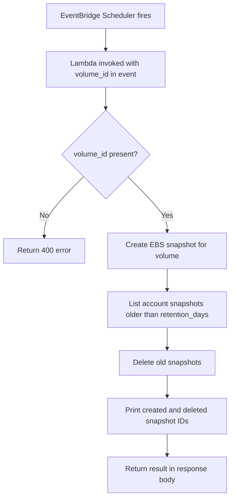

AWS setup checklist

* EBS — Test volume `vol-0df6245d9e6ddd9d6` (`gk-ebs-snapshot-test`) in **ap-south-1a**, 8 GiB gp3.

* IAM roles — Two roles with different purposes:

  | Role | Trusted by | Policies |
  |------|------------|----------|
  | `lamada` | Lambda | `AmazonEC2FullAccess`, `AWSLambdaBasicExecutionRole` |
  | `gk_ebs_snapshot_scheduler_role` | **EventBridge Scheduler** | `lambda:InvokeFunction` on `gk_ebs_snapshot_cleanup` |

* Lambda — Function `gk_ebs_snapshot_cleanup`, Python 3.x runtime, handler `lambda_function.lambda_handler`, role `lamada`.

  **No environment variables.** Volume ID and retention come from the event payload.

* EventBridge Scheduler — Schedule `gk-ebs-snapshot-weekly`:

  | Field | Value |
  |-------|-------|
  | Schedule expression | `cron(0 9 ? * MON *)` (every Monday 9:00 AM, Asia/Calcutta) |
  | Target | Lambda `gk_ebs_snapshot_cleanup` |
  | Execution role | `gk_ebs_snapshot_scheduler_role` |
  | Payload | Constant JSON (see below) |

  **Target payload (constant JSON):**

  ```json
  {
    "volume_id": "vol-0df6245d9e6ddd9d6",
    "retention_days": 30
  }
  ```

* Test — Two manual Lambda tests plus optional scheduler test:

  1. **retention_days=30** — creates snapshot, no deletions
  2. **retention_days=0** — creates snapshot, deletes all older snapshots
  3. **Scheduler (optional)** — temporarily set `rate(2 minutes)` to verify automated runs

Check CloudWatch log group `/aws/lambda/gk_ebs_snapshot_cleanup` for lines like `Created snapshot: snap-xxx` and `Deleted snapshot: snap-yyy`.

## Test events

**Create snapshot only (retention 30 days):**

```json
{
  "volume_id": "vol-0df6245d9e6ddd9d6",
  "retention_days": 30
}
```

**Create snapshot and delete old ones (retention 0 days):**

```json
{
  "volume_id": "vol-0df6245d9e6ddd9d6",
  "retention_days": 0
}
```

## Screenshots

| Step | File |
|------|------|
| EBS volume (before test) | [ebs-volume.png](screenshots/ebs-volume.png) |
| EventBridge Scheduler config | [eventbridge-schedule.png](screenshots/eventbridge-schedule.png) |
| Lambda test — retention 30 days | [lambda-test-retention-30-days.png](screenshots/lambda-test-retention-30-days.png) |
| Lambda test — retention 0 days | [lambda-test-retention-0-days.png](screenshots/lambda-test-retention-0-days.png) |
| Lambda test — automated snapshot | [lambda-test-run.png](screenshots/lambda-test-run.png) |
| EC2 snapshots after run | [ebs-snapshots-after.png](screenshots/ebs-snapshots-after.png) |
| CloudWatch logs (manual tests) | [cloudwatch-logs.png](screenshots/cloudwatch-logs.png) |
| Scheduler CloudWatch logs (2 min test) | [scheduler-cloudwatch-logs.png](screenshots/scheduler-cloudwatch-logs.png) |
| Scheduler snapshots create/delete cycle | [scheduler-snapshots-cleanup.png](screenshots/scheduler-snapshots-cleanup.png) |

## CLI test

```bash
aws lambda invoke \
  --function-name gk_ebs_snapshot_cleanup \
  --region ap-south-1 \
  --payload '{"volume_id":"vol-0df6245d9e6ddd9d6","retention_days":30}' \
  --cli-binary-format raw-in-base64-out \
  response.json && cat response.json
```

## Cleanup (stop billing when done)

```bash
aws scheduler delete-schedule --name gk-ebs-snapshot-weekly --region ap-south-1
aws lambda delete-function --function-name gk_ebs_snapshot_cleanup --region ap-south-1
aws logs delete-log-group --log-group-name /aws/lambda/gk_ebs_snapshot_cleanup --region ap-south-1

# Delete all snapshots for the test volume, then:
aws ec2 delete-volume --volume-id vol-0df6245d9e6ddd9d6 --region ap-south-1

aws iam delete-role-policy --role-name gk_ebs_snapshot_scheduler_role --policy-name InvokeEbsSnapshotLambda
aws iam delete-role --role-name gk_ebs_snapshot_scheduler_role
```
