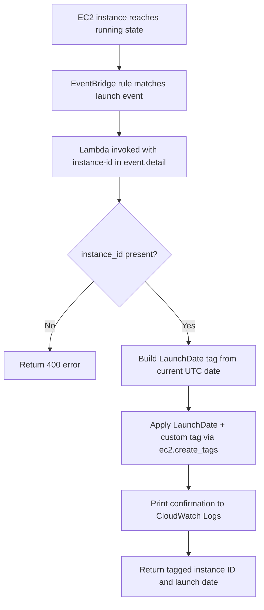

AWS setup checklist

* EC2 — Launch a test instance (e.g. Amazon Linux 2023 t2.micro). Test instance used: `i-000cf8b2ec746da77` (`gkautotag`).

* IAM role — Lambda execution role `lamada` with:

  - `AmazonEC2FullAccess` (or scoped `ec2:CreateTags`)
  - `AWSLambdaBasicExecutionRole` (required for CloudWatch Logs)

* Lambda — Function `gk_ec2_auto_tag`, Python 3.x runtime, handler `lambda_function.lambda_handler`, role `lamada`.

* Environment variables (optional — defaults shown):

  | Key | Default | Purpose |
  |-----|---------|---------|
  | `CUSTOM_TAG_KEY` | `Environment` | Second tag key applied on launch |
  | `CUSTOM_TAG_VALUE` | `Dev` | Second tag value applied on launch |

* EventBridge rule — Rule `ec2-autotag`, event bus `default`, target `gk_ec2_auto_tag`:

  ```json
  {
    "source": ["aws.ec2"],
    "detail-type": ["EC2 Instance State-change Notification"],
    "detail": {
      "state": ["running"]
    }
  }
  ```

  Do not set a target execution role for Lambda — grant invoke permission on the Lambda instead (see CLI section).

* Test — Launch a new EC2 instance or manually invoke Lambda. Instance should show tags `LaunchDate=YYYY-MM-DD` and `Environment=Dev`.

Check CloudWatch log group `/aws/lambda/gk_ec2_auto_tag` for lines like `Tagged instance i-xxx with LaunchDate=2026-06-21`.

## Screenshots

| Step | File |
|------|------|
| EventBridge rule and event pattern | [eventbridge-rule.png](screenshots/eventbridge-rule.png) |
| Lambda IAM role policies | [lambda-iam-role.png](screenshots/lambda-iam-role.png) |
| Lambda test invocation result | [lambda-test-run.png](screenshots/lambda-test-run.png) |
| CloudWatch logs | [cloudwatch-logs.png](screenshots/cloudwatch-logs.png) |
| EC2 instance tags after launch | [ec2-tags-after.png](screenshots/ec2-tags-after.png) |

## CLI test

Manual invoke with an EventBridge-style payload:

```bash
aws lambda invoke \
  --function-name gk_ec2_auto_tag \
  --payload '{"detail":{"instance-id":"i-000cf8b2ec746da77"}}' \
  --cli-binary-format raw-in-base64-out \
  response.json && cat response.json
```

Verify tags on the instance:

```bash
aws ec2 describe-tags \
  --filters "Name=resource-id,Values=i-000cf8b2ec746da77" \
  --query 'Tags[*].[Key,Value]' \
  --output table
```

EventBridge invoke permission (required once):

```bash
aws lambda add-permission \
  --function-name gk_ec2_auto_tag \
  --statement-id eventbridge-ec2-autotag \
  --action lambda:InvokeFunction \
  --principal events.amazonaws.com \
  --source-arn arn:aws:events:ap-south-1:232818307988:rule/ec2-autotag
```

## Cleanup (stop billing when done)

```bash
# Terminate test instances first, then:
aws events remove-targets --rule ec2-autotag --ids 8a801670-5c79-44d4-b7c7-dd71cf4a2a55
aws events delete-rule --name ec2-autotag
aws lambda delete-function --function-name gk_ec2_auto_tag
```
