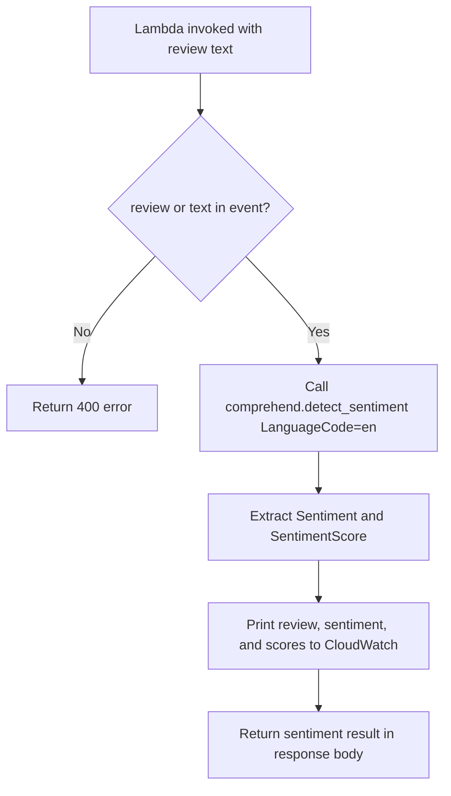

AWS setup checklist

* IAM role — Lambda execution role `lamada` with:

  - `ComprehendReadOnly` (or scoped `comprehend:DetectSentiment`)
  - `AWSLambdaBasicExecutionRole` (required for CloudWatch Logs)

* Lambda — Function `gk_comprehend_sentiment`, Python 3.x runtime, handler `lambda_function.lambda_handler`, role `lamada`.

* Region — Use **ap-south-1** (Mumbai). Amazon Comprehend must be available in the same region as the Lambda function.

* Test — Manually invoke with sample reviews (positive, negative, neutral). No S3, SNS, or EventBridge required.

Check CloudWatch log group `/aws/lambda/gk_comprehend_sentiment` for lines like `Sentiment: POSITIVE` and score breakdown.

## Test events

**Positive review**

```json
{
  "review": "I absolutely love this product! It works perfectly and exceeded my expectations."
}
```

**Negative review**

```json
{
  "review": "Terrible experience. The product broke on day one and support was unhelpful."
}
```

**Neutral review**

```json
{
  "review": "The package arrived on Tuesday. It contains a blue widget and an instruction manual."
}
```

Expected `sentiment` values: `POSITIVE`, `NEGATIVE`, `NEUTRAL`, or `MIXED`.

## Screenshots

| Step | File |
|------|------|
| Lambda function code in console | [lambda-function.png](screenshots/lambda-function.png) |
| Lambda test — positive review | [lambda-test-positive.png](screenshots/lambda-test-positive.png) |
| Lambda test — negative review | [lambda-test-negative.png](screenshots/lambda-test-negative.png) |
| CloudWatch logs (both sentiments) | [cloudwatch-logs.png](screenshots/cloudwatch-logs.png) |
| CloudWatch logs (console test runs) | [cloudwatch-logs-console.png](screenshots/cloudwatch-logs-console.png) |

## CLI test

Positive review:

```bash
aws lambda invoke \
  --function-name gk_comprehend_sentiment \
  --region ap-south-1 \
  --payload '{"review":"I absolutely love this product! It works perfectly."}' \
  --cli-binary-format raw-in-base64-out \
  response.json && cat response.json
```

Negative review:

```bash
aws lambda invoke \
  --function-name gk_comprehend_sentiment \
  --region ap-south-1 \
  --payload '{"review":"Terrible product, complete waste of money."}' \
  --cli-binary-format raw-in-base64-out \
  response.json && cat response.json
```

Direct Comprehend API test (without Lambda):

```bash
aws comprehend detect-sentiment \
  --text "I love this product!" \
  --language-code en \
  --region ap-south-1
```

## Cleanup

```bash
aws lambda delete-function --function-name gk_comprehend_sentiment --region ap-south-1
```

Comprehend charges per API call (very low for a few test invocations). No persistent resources to delete beyond the Lambda function.
